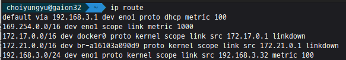
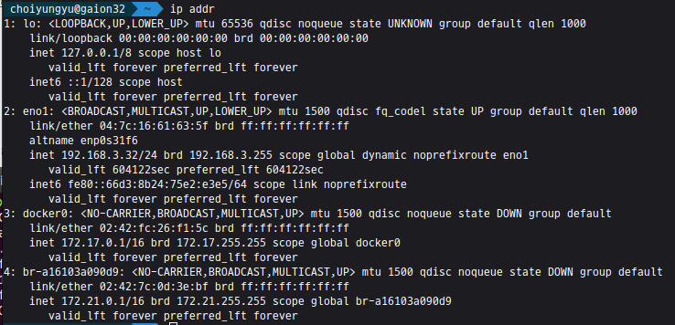

s# Ubuntu

## 1. Ubuntu ISO download
[Ubuntu 22.04 LTS](https://ubuntu.com/download/desktop)  

## 2. Tool creating bootable USB
[Rufus Tools](https://github.com/pbatard/rufus/releases/download/v3.20/rufus-3.20.exe)

1) rufus-3.20 설치
2) 
3) 장치: 설치할 USB 선택
4) 부트 유형 > 선택 : 다운 받은 ISO 파일 선택

## 3. 부팅 디스크 설정

### 3-1. DELL

  [F2] - System Setup - System BIOS - Boot Settings - BIOS Boot Settings - Hard-Disk Drive Sequence (USB를 최상단으로) 

  (설정 완료하면 재부팅되고 기다리면 우분투 설치 시작됨)

  *Try or install Ubuntu

  (파티선 설정, 지역 설정 등 설정을 하고 설치)

  설치 완료 후 Please remove the intallation medium, then press Enter: 가 나오면 USB 제거하고 Enter 

*BIOS: 바이오스(BIOS; Basic Input/Output System)는 운영 체제 중 가장 기본적인 소프트웨어이자 컴퓨터의 입출력을 처리하는 펌웨어다. 사용자가 컴퓨터를 켜면 시작되는 프로그램으로 주변 장치(하드웨어)와 컴퓨터 운영 체제(소프트웨어) 사이의 데이터의 흐름을 관리한다.

**게이트웨이: 게이트웨이(gateway, 문화어: 망관문)는 컴퓨터 네트워크에서 서로 다른 통신망, 프로토콜을 사용하는 네트워크 간의 통신을 가능하게 하는 컴퓨터나 소프트웨어를 두루 일컫는 용어, 즉 다른 네트워크로 들어가는 관문(입구) 역할을 하는 네트워크 포인트이다.

### 4. 게이트웨이 설정 with netplan
Ubuntu 18 LTS 부터는 netplan을 사용해서 .yaml 파일로 설정

#### 기타 필요한 tools 설치
    % sudo apt update 
    % sudo apt install vim              // vim은 색깔이 있어서 vi보다 보기 편함
    % sudo apt-get install net-tools    // ifconfig 같은 명령어 실행하기 위해 설치

### 4-1. netplan 파일

    % ls /etc/netplan/ (여기서 탭 눌러주면 파일명 나옴)
    % sudo netplan generate     // 파일이 없는 경우 생성

    % sudo vim /etc/netplan/ (탭 눌러스 .yaml 파일 편집기 열기)
######
    netwokr:
      version: 2
      renderer: networkd
      ethernets:
        {이더넷이름}:
          dhcp4: no
          dhcp6: no
          addresses:
            - {원하는 고정 ip}   // ex. 192.168.3.98/24
          routes:
            - to: default
              via: {게이트웨이ip}    // ex. 192.168.3.1
          nameservers:
            addresses:
              - 8.8.8.8
              - 8.8.4.4

#### 게이트웨이 ip 찾기
    % ip route      // 라우트 정보 확인, default vi 뒤에 ip 주소가 나중에 쓸 게이트웨이 주소

#### 이더넷 이름 찾기
    % ip addr       // 1: lo: 아래 2: 다음에 위치한게 이더넷 이름

### 4-2. 기타 권한 설정 및 적용
    % sudo chmod 600 /etc/netplan/ {탭 눌러서 .yaml 파일 선택}
    % sudo netplan apply

    # WARNING:root:Cannot call Open vSwitch: ovsdb-server.service is not running 발생할 경우
    % sudo apt install openvswitch-switch
    
### 4-3. ssh

    # SERVER SIDE
    % sudo apt install openssh-server   // openssh-server 설치
    % sudo systemctl status ssh         // 상태 확인

    % sudo systemctl enable ssh         
    % sudo systemctl start ssh          // 만약 실행중이 아니라면 실행

    % sudo systemctl stop ssh           // ssh 비활성화

    % sudo ufw status       // 방화벽 확인
    % sudo ufw allow ssh    // 방화벽 열기

    % sudo systemctl disable ssh  // 부팅 중 ssh 비활성화
    % sudo systemctl enable ssh   // 부팅 중 ssh 활성화

######
    # CLIENT SIDE
    % sudo apt install openssh-client   // openssh-client 설치
    % ssh {userName}@{IpAddress}

    