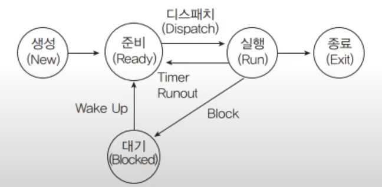

# OS, Operating System

## 1. 컴퓨터 구조

### 1-1. 메인 보드(Mainboard, Motehrboard, Systemboard)

메인 보드의 핵심적인 역할은 하드웨어를 통합하는 것이다. CPU, RAM, SSD, Power Supply 등을 연결하고 시스템 버스를 통해 서로가 정보를 교환할 수 있도록 한다. 또한 다양한 입출력 포트를 제공하여 컴퓨터가 외부 기기와 연결될 수 있게 한다.

### 1-2. 시스템 버스(System Bus)

시스템 버스는 한 덩어리의 데이터를 전송하는 전선 모음이다. 메인 보드에 연결된 하드웨어 구성요소들은 버스를 통해서 정보를 서로 교환한다. 다시말해, 버스는 컴퓨터 부품끼리 정보를 주고받는 일종의 통로인 것이다.

#### 제어 버스(Control Bus), 단방향

제어 버스는 CPU가 다른 하드웨어 장치를 제어하기 위해 사용한다. 제어 버스에 의해 하드웨어에 명령이 전달되면 메모리 읽기/쓰기, I/O 입출력 동작이 가능하게 된다.

#### 주소 버스(Address Bus), 단방향

주소 버스는 메모리나 입출력 장치와 같은 주변 장치를 식별하기 위한 주소 정보를 전달하는데 주로 사용된다.

#### 데이터 버스(Data Bus), 양방향

데이터 버스는 하드 웨어 구성 요소들 간의 데이터를 전송하는데 사용된다. 데이터 버스의 비트 수(폭)는 한 번에 전송할 수 있는 데이터 양을 나타내는데, 더 넓은 데이터 버스는 더 많은 데이터를 한 번에 전송할 수 있어서 빠른 데이터 전송을 지원한다.

### 1-3. 중앙처리장치(CPU)

컴퓨터가 이해할 수 있는 정보는 데이터와 명령어 두 가지이다. **데이터**는 숫자, 문자, 이미지, 동영상과 같은 정적인 정보이고, **명령어**는 컴퓨터를 움직이는 정보이다. CPU는 컴퓨터의 모든 명령어와 데이터 처리를 담당한다.

CPU 내부에는 레지스터라고하는 자체 메모리 셀이 존재한다. CPU는 RAM에 있는 데이터를 이 레지스터로 불러와서 연산을 수행한다. 이 때 명령어 집합의 각 연산에는 할당된 번호가 존재한다. (프로그램 코드는 수행할 연산 번호들을 순서에 따라 배열한 것이다.)

CPU의 동작은 메모리의 명령어를 끊임없이 가져와서 수행하는 무한 루프이다. 이때 수행할 명령어가 기록된 메모리 주소를 가리키는 특별한 레지스터를 프로그램 카운터라고 한다. CPU는 프로그램 카운터가 가리키는 메모리 주소에서 명령어를 로드하고 카운터를 1증가시킨 후 가져온 명령을 수행하는 작업을 무한 반복한다. (한편 프로그램 카운터에 새로운 값을 써넣어 실행 흐름을 메모리의 다른 지점으로 건너 뛰도록 하는 명령을 점프라고 한다.)

### 1-4. 메모리(RAM)

메모리는 수많은 셀로 나누어져 저마다 미세한 데이터나 명령어를 저장한다. 각 셀은 서로 구분하기 위한 주소값을 가지고 있어서 원하는 데이터나 명령에 선택적으로 접근할 수 있다.

### 1-5. 보조 기억 장치(SSD, HDD)

 
 
 

## 2. 운영체제(Operating System)

운영체제는 사용자가 컴퓨터 하드웨어를 쉽게 사용할 수 있도록 인터페이스를 제공해주는 소프트웨어이다. **스케줄링**을 담당해서 다중 사용자와 다중 응용 프로그램 환경 하에서 자원의 현재 상태를 파악하고 자원 분배 한다. 또한 **자원 관리**를 하여 CPU, 메모리 공간, 기억장치, 입출력 장치 등의 시스템 자원을 관리한다.

### 2-1. 커널(Kernel)과 쉘(Shell)

사용자가 입력한 명령은 쉘과 커널을 거쳐 하드웨어를 제어하게 된다. 우리가 명령을 입력하면 컴퓨터 내부에서 쉘이 받아들이고, 커널이 해석하여 하드웨어를 조작하는 것이다.

#### 커널(Kernel)

커널(Kernel)은 운영 체제의 핵심 부분으로 하드웨어 및 시스템 자원을 관리하며, 모든 소프트웨어와 하드웨어 구성 요소 간의 인터페이스 역할을 한다. 대표적인 커널에는 Linux, macOS, Microsoft Windows 커널 등이 있다.

#### 쉘(Shell)

쉘(Shell)은 운영체제의 가장 바깥에서 사용자와 운영체제 간의 대화가 가능하도록 명령어 해석기 역할을 하는 인터페이스이다. 대표적인 쉘에는 bash, zsh 등이 있다.

#### 쉘 스크립트(Shell Script)

쉘 스크립트는 쉘 명령어들을 텍스트 파일에 모아두고 스크립트 언어처럼 컴파일 없이 위에서 한줄씩 실행하는 프로그래밍 언어이다.

### 2-2. 메모리 관리(시스템 자원을 관리, 물리적인 메모리 크기보다 큰 경우 가상 메모리를 할당)

-   최초 적합: 프로세스가 적재될 수 있는 가용 공간 중에서 첫번째 분할에 할당하는 방법
-   최적 적합: 프로세스가 적재될 수 있는 가용 공간 중 가장 크기가 비슷한 공간을 선택하여 할달하는 방법
-   최악 적합: 프로세스 가용 공간들 중 가장 큰 공간에 할당하는 방법

### 2-3. 프로세스 관리(어떤 프로세스를 먼저 처리하고 오래 처리할지 관리)

-   생성: 프로그렘이 메인 메모리에 할당된다.
-   준비: 할당된 프로그램이 초기화와 같은 작업을 통해 실행되기 위한 모든 준비를 마친다.
-   실행: CPU가 해당 프로세스를 실행한다.
-   대기: 프로세스가 끝나지 않은 시점에서 I/O로 인해 중단 된다.
-   종료: 프로세스가 완전히 종료된다.

### 2-4. 프로세스 스케줄링 알고리즘

-   선점형 스케줄링 알고리즘: 하나의 프로세스가 CPU를 점유 중일 때, 우선 순위가 높은 다른 프로세스가 CPU 점유를 뺏어갈 수 있다.
-   비선점형 스케줄링 알고리즘: 하나의 프로세스가 CPU를 점유하면, CPU 반환 전까지 다른 프로세스는 CPU를 뺏지 못한다.

### 2-5. 응용 프로그램(Application)

-   프로시저: 프로그램 내에서 특정 작업을 수행하기 위해 사용되는 코드 조각
-   스레드: 프로세스 내에서 실행되는 작업 단위
-   프로세스: 실행 중인 프로그램 인스턴스
-   애플리케이션: 사용자가 실행하는 소프트웨어 프로그램
